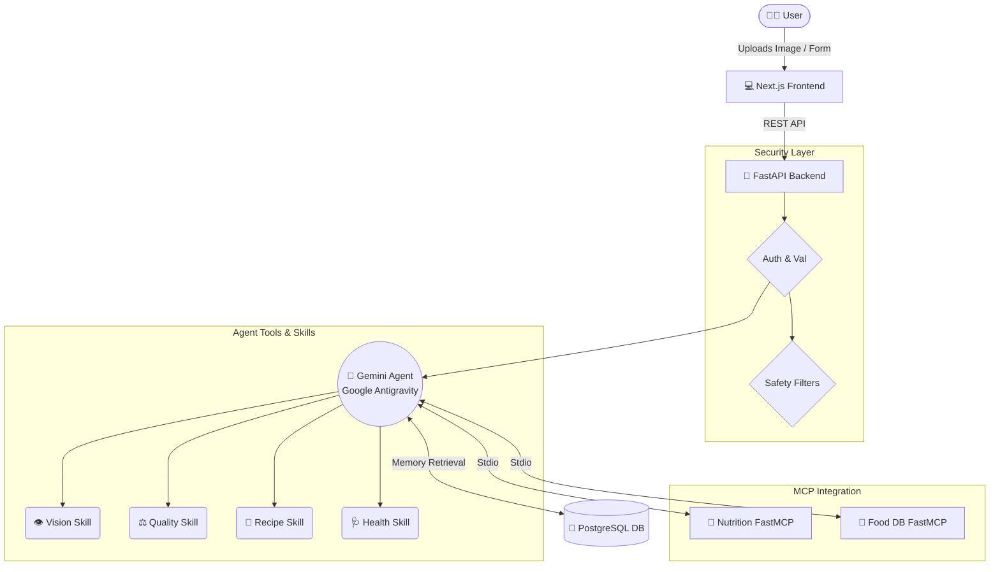

# 🍏 FoodAI - Intelligent Food Assistant


FoodAI is an enterprise-grade, multimodal AI agent designed to revolutionize how we interact with food. Powered by the **Google Antigravity SDK**, **Gemini 2.5**, and the **Model Context Protocol (MCP)**, FoodAI analyzes food images to assess freshness, grades quality, retrieves rich nutritional intelligence, and acts as a personalized dietitian and chef.

---

## 🌟 Key Features

1. **Food Vision Analysis**: Upload an image to instantly identify food items, detect defects (bruising, wilting), and assess overall freshness.
2. **Quality Grading**: Automatically assigns Grade A, B, or C based on visual freshness and database heuristics.
3. **Nutrition Intelligence**: Integrates an MCP Server (`fastmcp`) to fetch precise, real-time macro and micronutrient data.
4. **Health Recommendation Engine**: Cross-references user memory (Age, Diet, Allergies, Goals) via PostgreSQL to offer safe, personalized dietary advice.
5. **Generative Recipes**: Dynamically generates tailored recipes based on scanned foods and fitness goals.

---

## 🏗 Architecture Diagram

FoodAI is built on a scalable, modular architecture separating the frontend, backend, agent logic, and databases.



---

## 🚀 Setup Instructions

### 1. Prerequisites
- Docker and Docker Compose
- Node.js 18+ (for local frontend dev)
- Python 3.11+ (for local backend dev)
- A **Gemini API Key** from [Google AI Studio](https://aistudio.google.com/app/api-keys)

### 2. Local Environment Setup
Clone the repository and set your API keys:

```bash
git clone https://github.com/your-username/FoodAI.git
cd FoodAI

# Set your Gemini API Key in your terminal environment
export GEMINI_API_KEY="your_actual_api_key_here"
# Set an API Secret for backend communication
export API_SECRET="my_secure_secret"
```

### 3. Run with Docker Compose
We use Docker Compose to orchestrate the PostgreSQL Database, FastAPI Backend, and Next.js Frontend simultaneously.

```bash
docker-compose up --build
```
- **Frontend**: http://localhost:3000
- **Backend API**: http://localhost:8000
- **Database**: localhost:5432

---

## ☁️ Google Cloud Run Deployment

FoodAI is pre-configured for serverless deployment on Google Cloud Run.

### 1. Deploy Database
Set up a **Cloud SQL for PostgreSQL** instance and retrieve your connection string.

### 2. Deploy Backend
```bash
gcloud run deploy foodai-backend \
  --source . \
  --allow-unauthenticated \
  --set-env-vars="GEMINI_API_KEY=your_key,DATABASE_URL=your_cloud_sql_url,FOODAI_API_KEY=your_api_secret"
```

### 3. Deploy Frontend
```bash
cd frontend
gcloud run deploy foodai-frontend \
  --source . \
  --allow-unauthenticated \
  --set-env-vars="NEXT_PUBLIC_API_URL=https://your-backend-url.run.app"
```

---

## 🔌 API Documentation

All API requests must include the `X-API-Key` header for security.

### `GET /`
**Description**: Health check endpoint.
**Response**: `{"status": "ok", "environment": "production", "message": "FoodAI Server is running."}`

### `POST /analyze-food`
**Description**: Analyzes an uploaded food image.
**Headers**: `X-API-Key: <your_secret>`
**Body (FormData)**:
- `file`: (File - image/jpeg, image/png)
- `user_id`: (String)
**Response**:
```json
{
  "conversation_id": "uuid",
  "analysis": {
    "food_items": ["Apple"],
    "quality_grade": "Grade A",
    "freshness_score": 95,
    "nutrition_facts": {...}
  }
}
```

### `POST /recommend`
**Description**: Fetches personalized food recommendations based on a health profile.
**Headers**: `X-API-Key: <your_secret>`
**Body (JSON)**:
```json
{
  "user_id": "user123",
  "age": 28,
  "goal": "Weight Loss",
  "diet": "Vegan",
  "allergies": ["Peanuts"]
}
```

### `POST /recipe`
**Description**: Generates a custom recipe for a specific food item.
**Headers**: `X-API-Key: <your_secret>`
**Body (JSON)**:
```json
{
  "user_id": "user123",
  "food_name": "Apple",
  "preferences": "Healthy Breakfast"
}
```

---

## 💻 Demo Instructions (Hackathon Presentation)

For a seamless presentation, we've built an **Interactive Demo Mode** directly into the frontend UI that doesn't rely on live API latency.

1. Open `http://localhost:3000` in your browser.
2. At the top of the **Home Dashboard**, click the glowing **"Run Demo (apple.jpg)"** button.
3. **The Simulation**: 
   - Watch the custom CSS laser scanner sweep across a sample Honeycrisp Apple.
   - Wait 2.5 seconds for the "Processing" state to complete.
4. **The Reveal**: The UI will gracefully slide in the structured data, highlighting:
   - **Quality**: Grade A
   - **Freshness**: 95% (with dynamic progress bars)
   - **Nutrition**: 95 kcal / 4g Fiber
   - **AI Context**: Recommends it for a healthy breakfast.
5. Click over to the **Health Profile** tab to show judges where user memory is captured and stored in PostgreSQL.
6. Click the **Recipes** tab to show the finalized *Apple Oats Bowl* recipe generation.

---

## 🛡 Security & Enterprise Features
- **Prompt Injection Protection**: Regex-based middleware rejects malicious instructions.
- **Medical Disclaimers**: Agent output is appended with medical disclaimers before returning to the client.
- **Harmful Content Filters**: Strips extreme dietary advice (e.g., starving/fasting) via a strict safety pipeline.
- **Persistent Memory**: Uses Postgres + SQLAlchemy to inject the user's historical context into the Antigravity system instructions.
